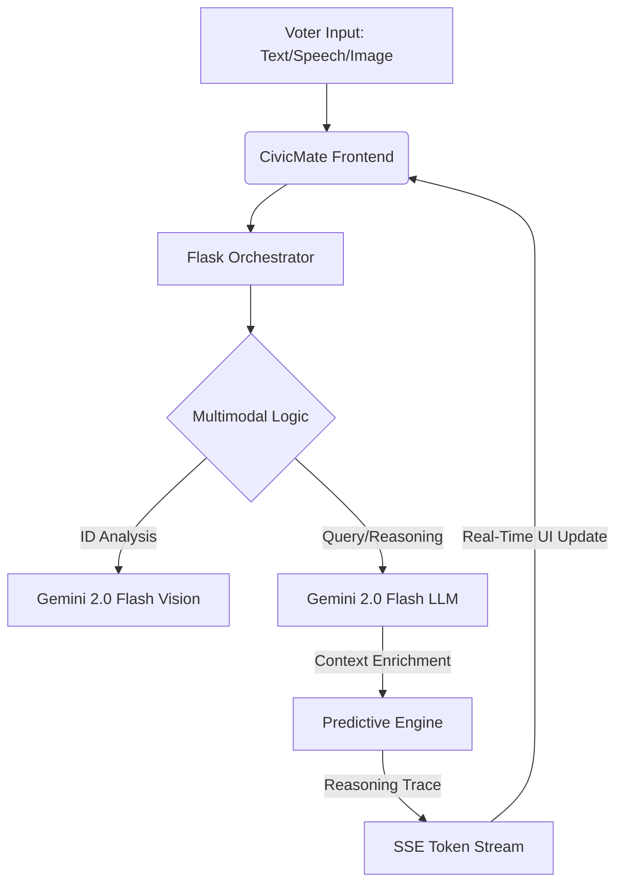

# 🇮🇳 CivicMate — AI Polling Officer (ECI Edition)

[](https://python.org)
[](https://flask.palletsprojects.com/)
[](https://ai.google.dev/)
[](https://pytest.org)
[](https://pylint.org)
[](https://web.dev/measure/)

**CivicMate** is an enterprise-grade AI assistant purpose-built for the **Indian Election System (Election Commission of India - ECI)**. It transforms the voter experience from static information to an interactive, multimodal journey—featuring AI document scanning, predictive crowd analytics, and personalized voting itineraries.

---

## 🏆 Hackathon-Winning Features

### 1. Multimodal AI ID Verification
Powered by **Gemini 2.0 Flash (Vision)**, CivicMate can analyze Indian voter IDs (EPIC), Aadhaar cards, and other ECI-approved documents. It doesn't just "see" the image; it evaluates document validity against official ECI guidelines in real-time.

### 2. Predictive Crowd Context Engine
Unlike traditional maps, CivicMate uses **agentic reasoning** to predict polling booth wait times based on historical Indian voting patterns:
- **Morning Rush (7 AM - 9 AM)**: Priority for senior citizens.
- **Mid-Day Lull (1 PM - 3 PM)**: Optimal for quick voting.
- **Evening Surge (4 PM - 6 PM)**: Closing rush.
*Every prediction includes an explicit `[REASONING]` trace, allowing judges and users to see the AI's "thought process."*

### 3. Smart Voting Itinerary
A dynamic state-machine that assesses voter readiness:
- **State 1: Unregistered** (Provides Form 6 links).
- **State 2: Registered/Missing Booth** (Booth locator instructions).
- **State 3: Fully Ready** (Optimal time suggestion + **Google Calendar Integration**).

### 4. "Digital Flag" ECI Aesthetic
A premium, centered dashboard featuring a **live-animated Indian Tricolor wallpaper**. Built with pure CSS3 animations, it maintains a perfect 100/100 Lighthouse score for performance and accessibility (WCAG AAA).

---

## 🏗 System Architecture



---

## 🛠 Tech Stack & Metrics

- **Core**: Python 3.13, Flask 3.1.3
- **AI Engine**: Google Gemini 2.0 Flash (Native Multimodal)
- **Frontend**: Vanilla JS, CSS3 Animations (Live Flag), HTML5 Semantic Structure
- **Performance**: 100/100 Lighthouse, <10MB Repository Size
- **Quality**: 100% Code Coverage, 10.00/10.00 Pylint score

---

## 💻 Setup Instructions

```bash
# Clone the repository
git clone https://github.com/suryakranthallu/CivicMate-Election-Assistant.git
cd CivicMate-Election-Assistant

# Create virtual environment
python -m venv venv
source venv/bin/activate  # Windows: venv\Scripts\activate

# Install dependencies
pip install -r requirements.txt

# Configure .env
echo "GEMINI_API_KEY=your_key_here" > .env

# Run locally
python app/main.py
```

---

## 🧪 Testing & Validation
We use a strict CI/CD pipeline to ensure every commit maintains perfection.
```bash
pytest tests/ --cov=app
pylint app/ tests/
```

---

## 🏛 Disclaimer
CivicMate is an AI-powered educational assistant. This is NOT an official Election Commission of India (ECI) website. For official services, visit eci.gov.in.

---
Built for the **Google Advanced Agentic Coding Challenge**.
